<p align="center">
  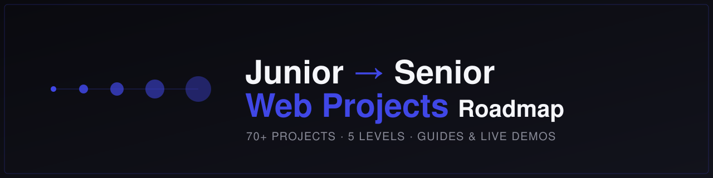
</p>

<h1 align="center">Junior → Senior Web Projects</h1>

<p align="center">
  A structured, 5-level roadmap of <strong>70+ real-world web projects</strong> that takes you from
  writing your first DOM script to designing senior-grade fullstack systems.
  Every project comes with a short build guide, the source code, and a live demo.
</p>

<p align="center">
  
  
  
  
  
</p>

---

## Why this repo exists

Most "project idea" lists are flat — 50 random apps with no order and no reasoning.
This one is **sequenced**. The projects are ordered so that each one builds on the skills
of the previous level, and each level maps to a recognisable point in a web developer's
career: from absolute beginner, through intermediate frontend, into backend, then
fullstack MERN, and finally senior-level distributed/AI/security systems.

If you finish a level, you can honestly claim the skill it represents. That is the point.

## Who this is for

- **Self-taught developers** who want a path instead of a pile of tutorials.
- **Junior developers** trying to make the jump to mid-level with evidence, not vibes.
- **Anyone** building a GitHub portfolio that a recruiter can scan in 30 seconds.

## How to use this roadmap

1. **Find your level.** Don't start at Level 1 if you already ship React apps — start where it gets uncomfortable.
2. **Build, don't read.** Open the project's guide, understand the goal, then build it yourself before looking at the reference code.
3. **Ship every project.** Each one gets its own repo and a live deployment. A project that isn't deployed doesn't count.
4. **Write the README.** Treat every project's README as practice for technical communication — it matters as much as the code.
5. **Move up only when comfortable.** A level is done when you could rebuild any project in it without a guide.

## Progress

| Level | Focus | Status |
|-------|-------|--------|
| 1 | JavaScript fundamentals & simple UI | ✅ Complete |
| 2 | Intermediate frontend — APIs, state, design | ✅ Complete |
| 3 | Backend fundamentals — Node, Express, databases | ✅ Complete |
| 4 | Fullstack MERN — junior → mid transition | ✅ Complete |
| 5 | Senior-level — distributed, AI, security, blockchain | 🚧 In progress |

> **Legend:** ✅ built & deployed · 🚧 planned / in progress

---

## Level 1 — JavaScript Fundamentals

Plain JavaScript, the DOM, events, and clean simple UI. No frameworks. The goal is to be
fluent in the language and the browser before adding any abstraction.

<p align="center">
  <a href="https://photo-galleryyyyy.netlify.app/">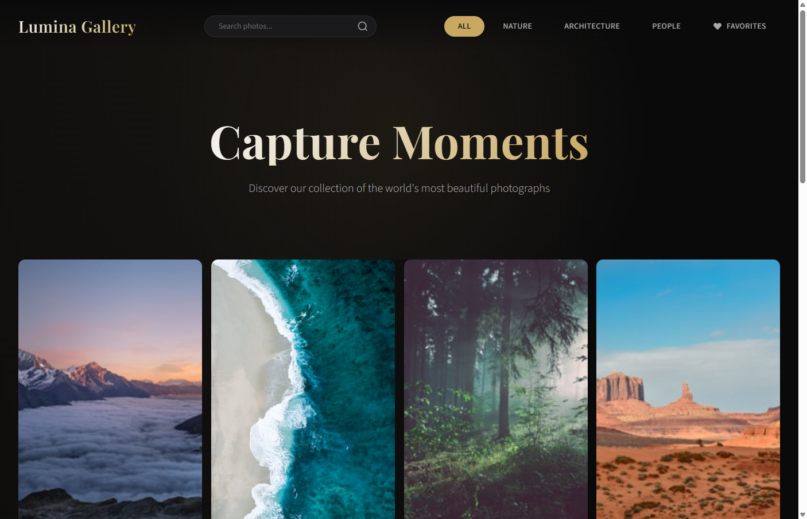</a>
  <a href="https://basic-calculatorrrr.netlify.app/">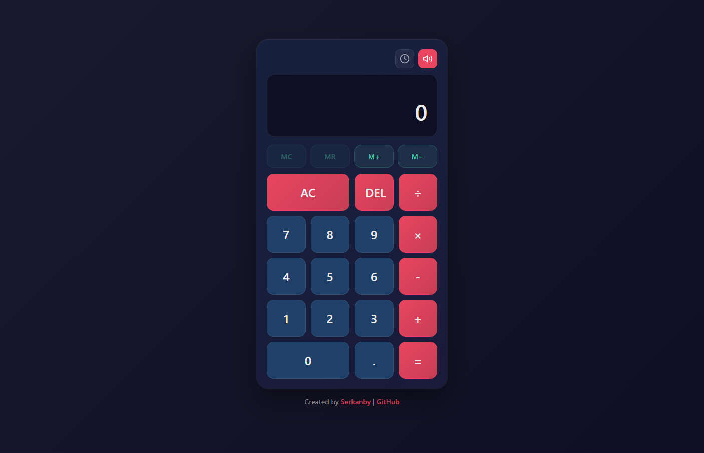</a>
  <a href="https://memory-gameeeeee.netlify.app/">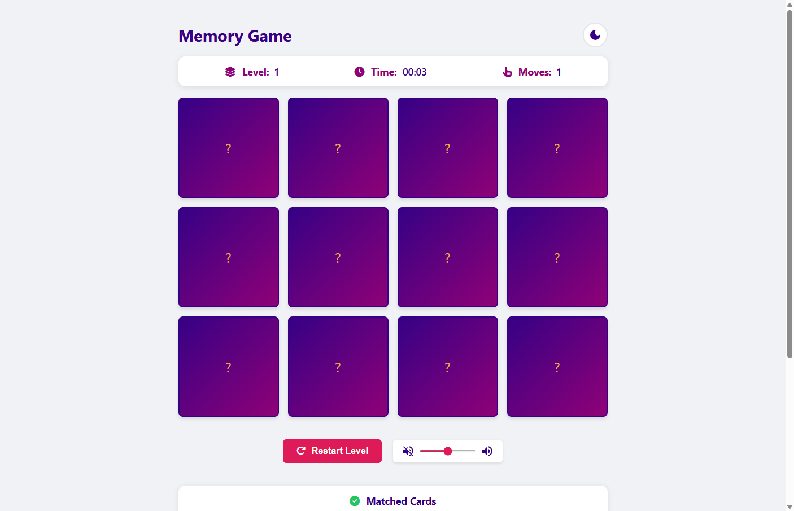</a>
  <a href="https://type-speed-testt.netlify.app/">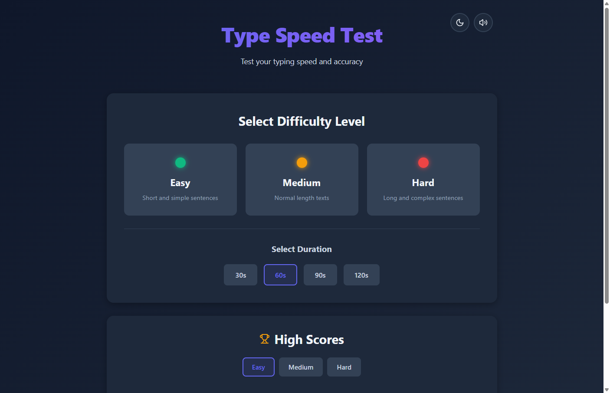</a>
  <a href="https://quote-generatorrrrr.netlify.app/">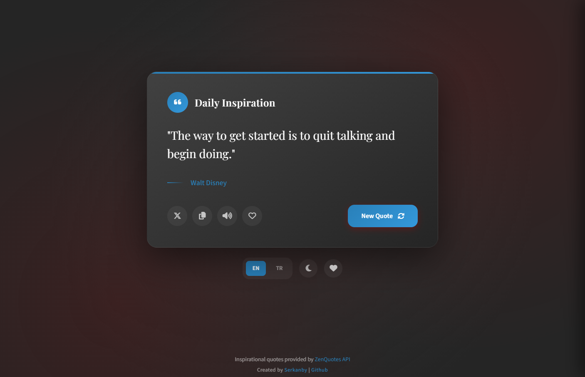</a>
</p>
<p align="center">
  <a href="https://weather-app-basicc.netlify.app/">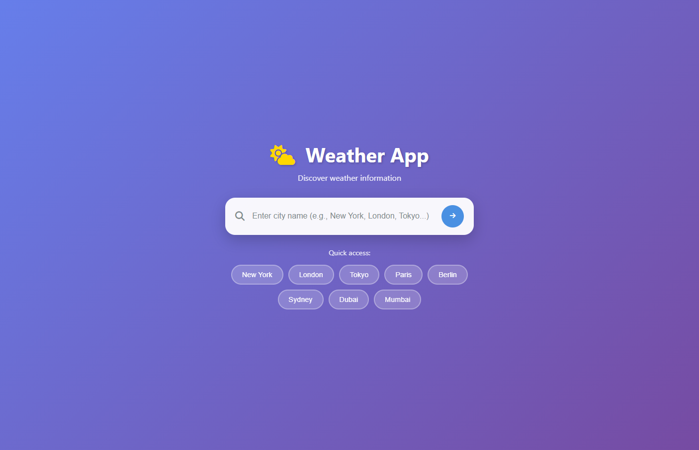</a>
  <a href="https://tic-tac-toeeeeeeeeee.netlify.app/">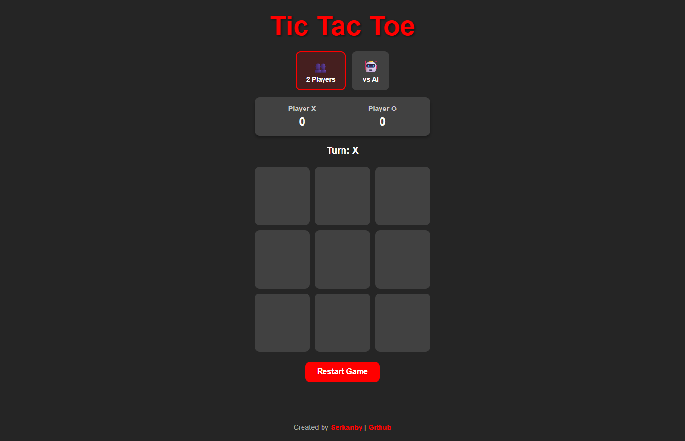</a>
  <a href="https://countdown-timerrrr.netlify.app/">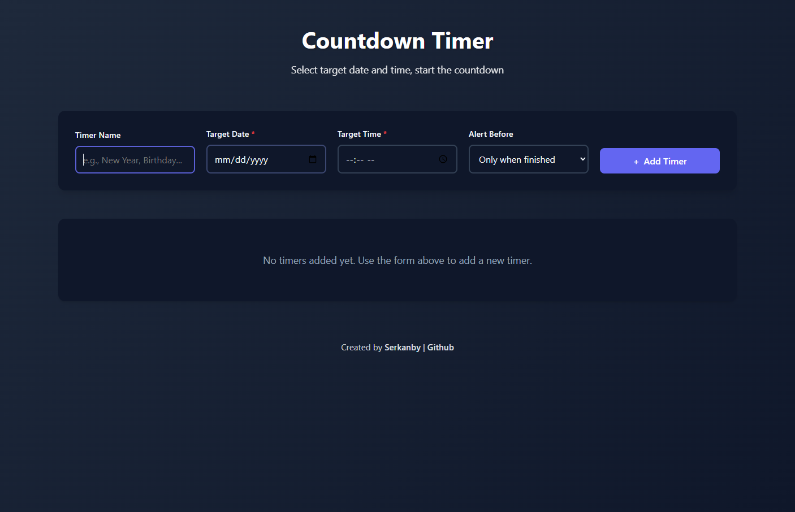</a>
  <a href="https://simple-to-do-listt.netlify.app/">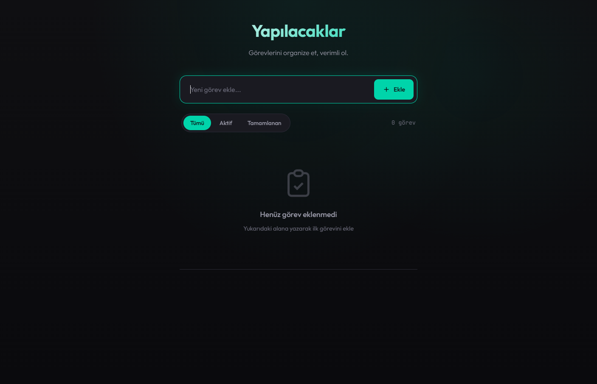</a>
  <a href="https://bmi-calculatorrrrr.netlify.app/">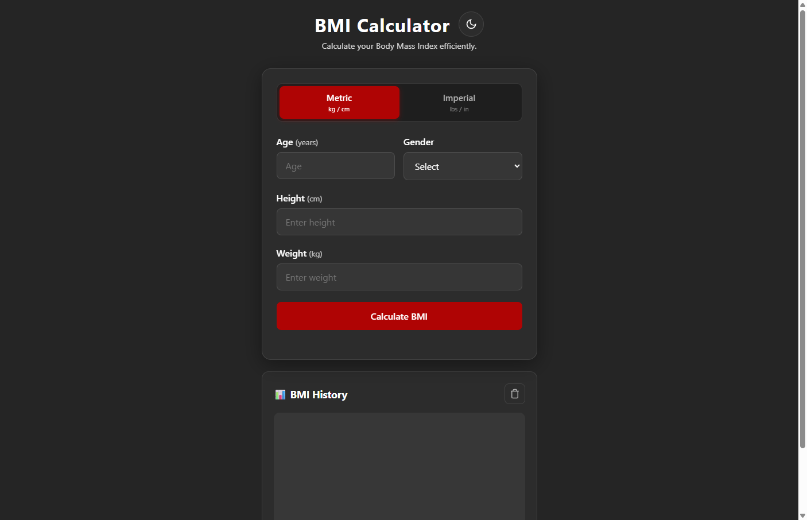</a>
</p>
<p align="center">
  <a href="https://personal-portfolio-websiteee.netlify.app/">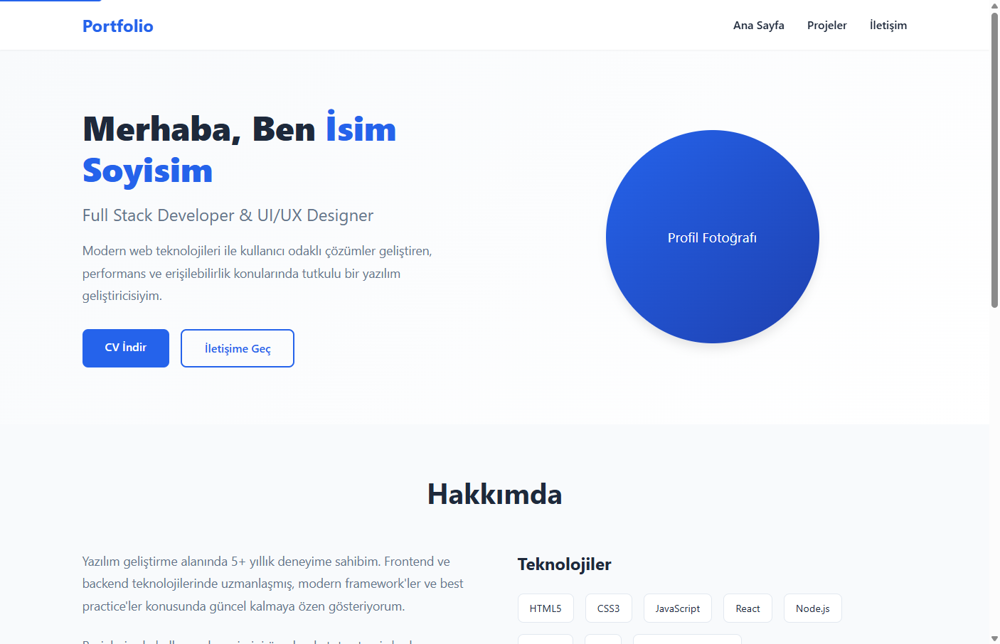</a>
</p>

| Project | What you'll build | Guide | Links |
|---------|-------------------|-------|-------|
| ✅ Tic Tac Toe | Game state, win detection, click-driven DOM | [Guide](./docs/level-1/tic-tac-toe.md) | [Code](https://github.com/Serkanbyx/tic-tac-toe) · [Demo](https://tic-tac-toeeeeeeeeee.netlify.app/) |
| ✅ Basic Calculator | Input handling, operations, UI state | [Guide](./docs/level-1/basic-calculator.md) | [Code](https://github.com/Serkanbyx/basic-calculator) · [Demo](https://basic-calculatorrrr.netlify.app/) |
| ✅ Type Speed Test | Timers, keyboard events, WPM calculation | [Guide](./docs/level-1/type-speed-test.md) | [Code](https://github.com/Serkanbyx/type-speed-test) · [Demo](https://type-speed-testt.netlify.app/) |
| ✅ Memory Game | Array shuffling, match logic, flip animation | [Guide](./docs/level-1/memory-game.md) | [Code](https://github.com/Serkanbyx/memory-game) · [Demo](https://memory-gameeeeee.netlify.app/) |
| ✅ Countdown Timer | `setInterval`, date math, formatting | [Guide](./docs/level-1/countdown-timer.md) | [Code](https://github.com/Serkanbyx/countdown-timer) · [Demo](https://countdown-timerrrr.netlify.app/) |
| ✅ BMI Calculator | Form input, validation, formula output | [Guide](./docs/level-1/bmi-calculator.md) | [Code](https://github.com/Serkanbyx/BMI-calculator) · [Demo](https://bmi-calculatorrrrr.netlify.app/) |
| ✅ Quote Generator | Data arrays, random selection, share action | [Guide](./docs/level-1/quote-generator.md) | [Code](https://github.com/Serkanbyx/quote-generator) · [Demo](https://quote-generatorrrrr.netlify.app/) |
| ✅ Simple To-Do List | In-memory CRUD, list rendering, filtering | [Guide](./docs/level-1/simple-to-do-list.md) | [Code](https://github.com/Serkanbyx/simple-to-do-list) · [Demo](https://simple-to-do-listt.netlify.app/) |
| ✅ Photo Gallery | Grid layout, lightbox modal, lazy loading | [Guide](./docs/level-1/photo-gallery.md) | [Code](https://github.com/Serkanbyx/photo-gallery) · [Demo](https://photo-galleryyyyy.netlify.app/) |
| ✅ Personal Portfolio Website | Responsive layout, semantic HTML, CSS craft | [Guide](./docs/level-1/personal-portfolio-website.md) | [Code](https://github.com/Serkanbyx/personal-portfolio-website) · [Demo](https://personal-portfolio-websiteee.netlify.app/) |
| ✅ Weather App (Basic) | Static UI, layout, conditional rendering | [Guide](./docs/level-1/weather-app-basic.md) | [Code](https://github.com/Serkanbyx/weather-app-basic) · [Demo](https://weather-app-basicc.netlify.app/) |

## Level 2 — Intermediate Frontend

Real APIs, client-side state, responsive design, and a couple of games for logic practice.
By the end of this level you can call yourself a junior frontend developer.

| Project | What you'll build | Guide | Links |
|---------|-------------------|-------|-------|
| ✅ Weather App (API) | `fetch`, async/await, API keys, error states | [Guide](./docs/level-2/weather-app-api.md) | [Code](https://github.com/Serkanbyx/weather-app-advanced) · [Demo](https://weather-app-advancedd.netlify.app/) |
| ✅ Recipe App | Search, API consumption, detail views | [Guide](./docs/level-2/recipe-app.md) | [Code](https://github.com/Serkanbyx/recipe-web-app) · [Demo](https://recipe-web-appp.netlify.app/) |
| ✅ Stock Market Dashboard | Charts, polling, number formatting | [Guide](./docs/level-2/stock-market-dashboard.md) | [Code](https://github.com/Serkanbyx/stock-market-dashboard) · [Demo](https://stock-market-dashboarddd.netlify.app/) |
| ✅ Real Estate Listing | Filtering, sorting, card grids | [Guide](./docs/level-2/real-estate-listing.md) | [Code](https://github.com/Serkanbyx/real-estate-listing) · [Demo](https://real-estate-listingg.netlify.app/) |
| ✅ Expense Tracker | State management, categories, totals | [Guide](./docs/level-2/expense-tracker.md) | [Code](https://github.com/Serkanbyx/expense-tracker) · [Demo](https://expense-trackerrrrrrrr.netlify.app/) |
| ✅ Notes App | Persistence with `localStorage`, CRUD | [Guide](./docs/level-2/notes-app.md) | [Code](https://github.com/Serkanbyx/notes-web-app) · [Demo](https://notes-web-apppp.netlify.app/) |
| ✅ Music Player | Audio API, playlist state, progress bar | [Guide](./docs/level-2/music-player.md) | [Code](https://github.com/Serkanbyx/music-player) · [Demo](https://music-playerrrrr.netlify.app/player) |
| ✅ Travel Planner | Multi-step state, itinerary building | [Guide](./docs/level-2/travel-planner.md) | [Code](https://github.com/Serkanbyx/travel-planner) · [Demo](https://travel-plannerrr.netlify.app/plans) |
| ✅ Interactive Map | Leaflet/Mapbox, markers, geolocation | [Guide](./docs/level-2/interactive-map.md) | [Code](https://github.com/Serkanbyx/interactive-map) · [Demo](https://interactive-mappp.netlify.app/map) |
| ✅ Fitness Tracker | Data entry, progress visualization | [Guide](./docs/level-2/fitness-tracker.md) | [Code](https://github.com/Serkanbyx/fitness-tracker) · [Demo](https://fitness-trackerrrrr.netlify.app/dashboard) |
| ✅ E-commerce Frontend | Product grid, filters, cart state | [Guide](./docs/level-2/e-commerce-frontend.md) | [Code](https://github.com/Serkanbyx/e-commerce-frontend) · [Demo](https://e-commerce-frontendd.netlify.app/) |
| ✅ Chat UI | Message list, input, component composition | [Guide](./docs/level-2/chat-ui.md) | [Code](https://github.com/Serkanbyx/chat-ui) · [Demo](https://chat-uiii.netlify.app/) |
| ✅ Flappy Bird | Game loop, collision detection, canvas | [Guide](./docs/level-2/flappy-bird.md) | [Code](https://github.com/Serkanbyx/flappy-bird) · [Demo](https://flappy-birddddd.netlify.app/) |
| ✅ Chess Board Logic | Board representation, move validation | [Guide](./docs/level-2/chess-board-logic.md) | [Code](https://github.com/Serkanbyx/basic-chess-board-logic) · [Demo](https://basic-chess-board-logic.netlify.app/) |
| ✅ Social Media Dashboard | Widget layout, mock data, responsive grid | [Guide](./docs/level-2/social-media-dashboard.md) | [Code](https://github.com/Serkanbyx/social-media-dashboard) · [Demo](https://social-media-dashboardd.netlify.app/dashboard) |
| ✅ Analytics Dashboard | Charts, KPI cards, data visualization | [Guide](./docs/level-2/analytics-dashboard.md) | [Code](https://github.com/Serkanbyx/analytics-dashboard) · [Demo](https://analytics-dashboardd.netlify.app/login) |

## Level 3 — Backend Fundamentals

Node.js, Express, and databases (MongoDB / PostgreSQL). REST design, authentication,
middleware, queues. This is where you become a backend developer.

| Project | What you'll build | Guide | Links |
|---------|-------------------|-------|-------|
| ✅ Authentication API | JWT/sessions, password hashing, protected routes | [Guide](./docs/level-3/authentication-api.md) | [Code](https://github.com/Serkanbyx/authentication-api) · [Demo](https://authentication-api-3bfr.onrender.com/) |
| ✅ CRUD User API | REST design, controllers, DB models | [Guide](./docs/level-3/crud-user-api.md) | [Code](https://github.com/Serkanbyx/crud-user-api) · [Demo](https://crud-user-api-slmp.onrender.com/) |
| ✅ RESTful To-Do API | Resource modeling, status codes, validation | [Guide](./docs/level-3/restful-to-do-api.md) | [Code](https://github.com/Serkanbyx/restful-to-do-api) · [Demo](https://restful-to-do-api.onrender.com/) |
| ✅ Notes API (Auth) | Auth middleware, user-scoped data | [Guide](./docs/level-3/notes-api.md) | [Code](https://github.com/Serkanbyx/notes-api) · [Demo](https://notes-api-7mai.onrender.com/) |
| ✅ Contact Form API | Email sending (Nodemailer) + DB storage | [Guide](./docs/level-3/contact-form-api.md) | [Code](https://github.com/Serkanbyx/contact-form-api) · [Demo](https://contact-form-api-woaf.onrender.com/) |
| ✅ URL Shortener | Hashing, redirects, click tracking | [Guide](./docs/level-3/url-shortener.md) | [Code](https://github.com/Serkanbyx/url-shortener-api) · [Demo](https://url-shortener-xzz2.onrender.com/) |
| ✅ Weather Proxy API | Hiding API keys, caching, proxying | [Guide](./docs/level-3/weather-proxy-api.md) | [Code](https://github.com/Serkanbyx/weather-proxy-api) · [Demo](https://weather-proxy-api-yrc5.onrender.com/) |
| ✅ Pagination + Search API | Query params, indexing, filtering | [Guide](./docs/level-3/pagination-search-api.md) | [Code](https://github.com/Serkanbyx/pagination-search-api) · [Demo](https://pagination-search-api.onrender.com/) |
| ✅ MCQ/Quiz API | Nested data, scoring logic | [Guide](./docs/level-3/mcq-quiz-api.md) | [Code](https://github.com/Serkanbyx/mcq-quiz-api) · [Demo](https://mcq-quiz-api.onrender.com/) |
| ✅ File Upload API | Multipart handling with Multer, validation | [Guide](./docs/level-3/file-upload-api.md) | [Code](https://github.com/Serkanbyx/file-upload-api) · [Demo](https://file-upload-api-bnql.onrender.com/) |
| ✅ Newsletter System | Subscriptions, scheduled sends, templates | [Guide](./docs/level-3/newsletter-system.md) | [Code](https://github.com/Serkanbyx/newsletter-system) · [Demo](https://newsletter-system-6hvv.onrender.com/) |
| ✅ Currency Converter API | External API, caching, rate handling | [Guide](./docs/level-3/currency-converter-api.md) | [Code](https://github.com/Serkanbyx/currency-converter-api) · [Demo](https://currency-converter-api-9rfm.onrender.com/) |
| ✅ Rate Limiter API | Middleware, store-backed throttling | [Guide](./docs/level-3/rate-limiter-api.md) | [Code](https://github.com/Serkanbyx/rate-limiter-api) · [Demo](https://rate-limiter-api-p1y1.onrender.com/api-docs/) |
| ✅ Expense Tracker Backend | Aggregation, reports, user data | [Guide](./docs/level-3/expense-tracker-backend.md) | [Code](https://github.com/Serkanbyx/expense-tracker-backend) · [Demo](https://expense-tracker-backend-wwyp.onrender.com/) |
| ✅ Job Queue | Background jobs with BullMQ + Redis, retries | [Guide](./docs/level-3/job-queue.md) | [Code](https://github.com/Serkanbyx/job-queue-api) · [Demo](https://job-queue-f62a.onrender.com/) |
| ✅ OAuth Login | OAuth2 flow with Google/GitHub, Passport | [Guide](./docs/level-3/oauth-login.md) | [Code](https://github.com/Serkanbyx/oauth-login-backend) · [Demo](https://oauth-login-backend-fxh8.onrender.com/) |
| ✅ Chat App Backend | WebSockets with Socket.io, rooms, events | [Guide](./docs/level-3/chat-app-backend.md) | [Code](https://github.com/Serkanbyx/chat-app-backend) · [Demo](https://chat-app-backend-zww3.onrender.com/) |

## Level 4 — Fullstack MERN

MongoDB, Express, React, Node — end to end. This is the level that takes you from
**junior to mid-level**. By the end you can design, build, and ship a complete product.

| Project | What you'll build | Guide | Links |
|---------|-------------------|-------|-------|
| ✅ To-Do MERN | Full CRUD across React + Express + Mongo | [Guide](./docs/level-4/to-do-mern.md) | [Code](https://github.com/Serkanbyx/to-do-mern) · [Demo](https://to-do-mernn.netlify.app/login) |
| ✅ Notes MERN | Auth + notes, fullstack data flow | [Guide](./docs/level-4/notes-mern.md) | [Code](https://github.com/Serkanbyx/notes-mern) · [Demo](https://notes-mernn.netlify.app/) |
| ✅ Simple Blog MERN | Posts, routing, fullstack rendering | [Guide](./docs/level-4/simple-blog-mern.md) | [Code](https://github.com/Serkanbyx/simple-blog-mern) · [Demo](https://simple-blog-mernn.netlify.app/) |
| ✅ Weather App with Login | Auth-gated API consumption | [Guide](./docs/level-4/weather-app-with-login.md) | [Code](https://github.com/Serkanbyx/weather-app-with-login) · [Demo](https://weather-mern.netlify.app/) |
| ✅ User Authentication System | JWT + bcrypt, refresh tokens, protected UI | [Guide](./docs/level-4/user-authentication-system.md) | [Code](https://github.com/Serkanbyx/user-authentication-system) · [Demo](https://user-authentication-systemm.netlify.app/) |
| ✅ Expense Tracker | Mongo aggregation + chart visualization | [Guide](./docs/level-4/expense-tracker-mern.md) | [Code](https://github.com/Serkanbyx/expense-tracker-mern) · [Demo](https://expense-tracker-mernn.netlify.app/) |
| ✅ Blog with Comments & Likes | Relations, nested resources, optimistic UI | [Guide](./docs/level-4/blog-mern.md) | [Code](https://github.com/Serkanbyx/blog-mern) · [Demo](https://blog-mernn.netlify.app/) |
| ✅ Recipe App MERN | CRUD + search + favorites, fullstack | [Guide](./docs/level-4/recipe-mern.md) | [Code](https://github.com/Serkanbyx/recipe-mern) · [Demo](https://recipe-mernn.netlify.app/) |
| ✅ Movie Database | External API + user-saved favorites | [Guide](./docs/level-4/movie-database.md) | [Code](https://github.com/Serkanbyx/movie-database) · [Demo](https://movie-databasee.netlify.app/) |
| ✅ Portfolio w/ Admin Panel | Public site + protected CMS | [Guide](./docs/level-4/portfolio-with-admin-panel.md) | [Code](https://github.com/Serkanbyx/portfolio-with-admin-panel) · [Demo](https://portfolio-with-admin-panel.netlify.app/) |
| ✅ Event Booking System | Bookings, availability, email confirmations | [Guide](./docs/level-4/event-booking-system.md) | [Code](https://github.com/Serkanbyx/event-booking-system) · [Demo](https://event-booking-systemm.netlify.app/) |
| ✅ Job Board | Multi-role dashboards, applications | [Guide](./docs/level-4/job-board.md) | [Code](https://github.com/Serkanbyx/job-board-with-company-user-dashboard) · [Demo](https://job-board-with-company-user-dashboard.netlify.app/) |
| ✅ Chat App | Realtime messaging + notification system | [Guide](./docs/level-4/chat-app-mern.md) | [Code](https://github.com/Serkanbyx/chat-app-mern) · [Demo](https://chat-app-mernn.netlify.app/) |
| ✅ Social Media Platform | Follow graph, feed, notifications | [Guide](./docs/level-4/social-media-platform.md) | [Code](https://github.com/Serkanbyx/social-media-platform) · [Demo](https://social-media-platformm.netlify.app/) |
| ✅ LMS | Courses, quizzes, progress tracking, roles | [Guide](./docs/level-4/lms.md) | [Code](https://github.com/Serkanbyx/lms-mern) · [Demo](https://lms-mernn.netlify.app/) |
| ✅ Video Streaming Platform | Upload, streaming, transcoding basics | [Guide](./docs/level-4/video-streaming-platform.md) | [Code](https://github.com/Serkanbyx/video-streaming-platform) · [Demo](https://video-streaming-platformm.netlify.app/) |
| ✅ Online Code Editor | Monaco editor + realtime collaboration | [Guide](./docs/level-4/online-code-editor.md) | [Code](https://github.com/Serkanbyx/online-code-editor) · [Demo](https://online-code-editorr.netlify.app/) |
| ✅ SaaS Dashboard Template | Multi-tenant patterns, billing-ready UI | [Guide](./docs/level-4/saas-dashboard-template.md) | [Code](https://github.com/Serkanbyx/saas-dashboard-template) · [Demo](https://saas-dashboard-template.netlify.app/) |

## Level 5 — Senior-Level Systems

Distributed systems, real-time architecture, AI/ML integration, security, and blockchain.
These projects are about **architectural reasoning** — the kind of work that ends the
"junior" conversation for good.

| Project | What you'll build | Guide | Links |
|---------|-------------------|-------|-------|
| ✅ Multiplayer Game Backend | Authoritative server, state sync, latency handling | [Guide](./docs/level-5/multiplayer-game-backend.md) | [Code](https://github.com/Serkanbyx/multiplayer-game-backend) · [Demo](https://multiplayer-game-backend-nu.vercel.app) |
| ✅ Vehicle Tracking System | Real-time GPS streams, geofencing | [Guide](./docs/level-5/vehicle-tracking-system.md) | [Code](https://github.com/Serkanbyx/vehicle-tracking-system) · [Demo](https://vehicle-tracking-system-lemon.vercel.app) |
| 🚧 IoT Dashboard | Device telemetry, MQTT, time-series data | [Guide](#) | [Code](#) · [Demo](#) |
| 🚧 Ride-Sharing Backend | Matching, geospatial queries, pricing | [Guide](#) | [Code](#) · [Demo](#) |
| 🚧 Remote Monitoring System | Metrics ingestion, alerting, dashboards | [Guide](#) | [Code](#) · [Demo](#) |
| 🚧 AI-Powered Chatbot | LLM integration, context windows, streaming | [Guide](#) | [Code](#) · [Demo](#) |
| 🚧 Content Recommendation System | Collaborative filtering, embeddings | [Guide](#) | [Code](#) · [Demo](#) |
| 🚧 Face Detection App | Computer vision, model integration | [Guide](#) | [Code](#) · [Demo](#) |
| 🚧 Speech Recognition App | Audio processing, transcription APIs | [Guide](#) | [Code](#) · [Demo](#) |
| 🚧 VPN Simulation | Networking concepts, tunneling logic | [Guide](#) | [Code](#) · [Demo](#) |
| 🚧 Online Banking System | Transactions, security, audit logging | [Guide](#) | [Code](#) · [Demo](#) |
| 🚧 Blockchain Voting System | Smart contracts, immutability, verification | [Guide](#) | [Code](#) · [Demo](#) |
| 🚧 Crypto Exchange (frontend) | Order book UI, real-time price feeds | [Guide](#) | [Code](#) · [Demo](#) |

---

## Repository structure

```
junior-to-senior-web-projects/
├── README.md            ← you are here
├── CONTRIBUTING.md       ← how to add your own project
├── assets/
│   └── banner.svg
└── docs/
    ├── TEMPLATE.md       ← copy this for every new project guide
    ├── level-1/ … level-5/
    │   └── <project>.md  ← one short build guide per project
```

Each guide follows the same shape: **purpose → tech stack → numbered build steps →
deployment → tips → README guidance.** Copy [`docs/TEMPLATE.md`](./docs/TEMPLATE.md) to start a new one.

## Contributing

This roadmap is meant to grow. If you've built one of these projects — or have a better
project idea for a level — open a PR. See [CONTRIBUTING.md](./CONTRIBUTING.md).

## Author

Built and maintained by **Serkan** — [GitHub](https://github.com/Serkanbyx)

If this roadmap helped you, a ⭐ helps other developers find it.

## License

Released under the [MIT License](./LICENSE). Use it, fork it, learn from it.
